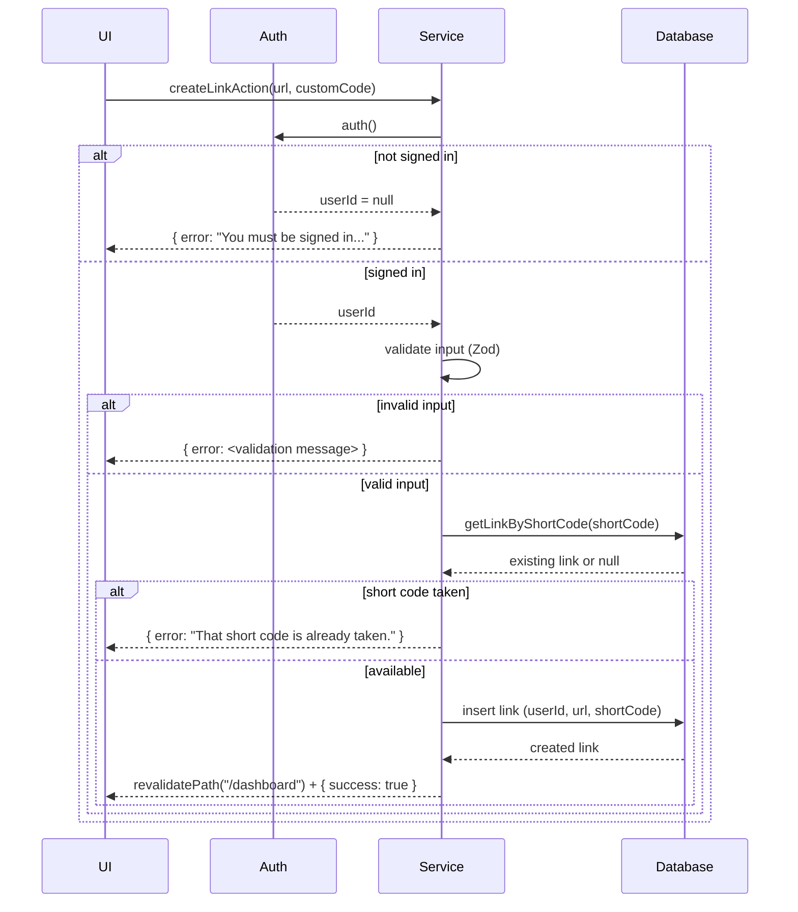

# Project Sequence Diagrams

## When to Use

- User asks for a "sequence diagram", "flow diagram", or "architecture diagram" of a feature.
- User asks "how does X work end-to-end" / "trace the request for X".
- User wants to visualize or document one of the app's request flows.

## Fixed Actors (always this order, never rename or add lanes)

| Actor | Maps to in this codebase |
|-------|---------------------------|
| **UI** | Client components / pages — e.g. [app/dashboard/page.tsx](../../../app/dashboard/page.tsx), [app/dashboard/create-link-dialog.tsx](../../../app/dashboard/create-link-dialog.tsx), [app/page.tsx](../../../app/page.tsx) |
| **Auth** | Clerk — route protection in [proxy.ts](../../../proxy.ts) and `auth()` calls inside Server Actions / DAL |
| **Service** | Server Actions ([app/dashboard/actions.ts](../../../app/dashboard/actions.ts)), Route Handlers (e.g. [app/l/[shortCode]/route.ts](../../../app/l/[shortCode]/route.ts)), and DAL functions ([data/links.ts](../../../data/links.ts)) — collapse these into one "Service" lane |
| **Database** | Drizzle queries against Neon Postgres — [db/index.ts](../../../db/index.ts), [db/schema.ts](../../../db/schema.ts) |

If a flow has no interaction with one of the actors (e.g. the public redirect never touches Auth), still include the lane in the diagram but skip messages to/from it — don't delete the participant.

## Known Flows (examples, not exhaustive)

These exist today; treat the list as a starting point, not a limit. As the app grows, apply the same actor mapping to any new Server Action, Route Handler, or page — search `app/` for `"use server"` files and `route.ts` handlers to find flows not listed here.

1. **Public redirect** — `GET /l/[shortCode]` → looks up link → 302 redirects or falls back to `/`. No Auth involved.
2. **Create link** — dashboard dialog submits → `createLinkAction` → checks `auth()`, validates with Zod, checks short-code collision, inserts row → `revalidatePath`.
3. **Update link** — same shape as create, but checks resource ownership (`userId`) on update.
4. **Delete link** — dialog confirm → `deleteLinkAction` → `auth()` check → delete scoped by `userId`.
5. **Dashboard load** — visiting `/dashboard` → proxy protects route → page calls `getLinksForCurrentUser()` → `auth()` → scoped select.

## Procedure

1. Identify which flow(s) the request covers. If it's broad ("diagram the app", "diagram the whole dashboard"), don't limit yourself to the list above — discover every relevant Server Action / Route Handler first.
2. Read the relevant source files (Server Action, route handler, DAL function, schema) to confirm the actual sequence of calls — don't guess at steps that aren't in the code.
3. Build **a single Mermaid `sequenceDiagram`** with participants declared once, in the fixed order: `UI`, `Auth`, `Service`, `Database`. For a single named flow, that's the whole diagram. For a broad/multi-flow request, keep all flows in that one diagram: separate each with `Note over UI,Database: Flow: <name>` and wrap each flow's messages in `rect rgb(...)` so they stay visually distinct — do not split multi-flow requests into separate diagram files.
4. Include both the success path and at least one early-return/error path (e.g. validation failure, not signed in, ownership mismatch) as `alt`/`else` blocks when the code has one.
5. Save the diagram as a single markdown file under `docs/diagrams/<name>-sequence.md` (create the folder if it doesn't exist) — use a feature-specific name for one flow, or something like `docs/diagrams/dashboard-overview-sequence.md` for a combined one. Confirm the file path back to the user.

## Example (Create Link flow)

