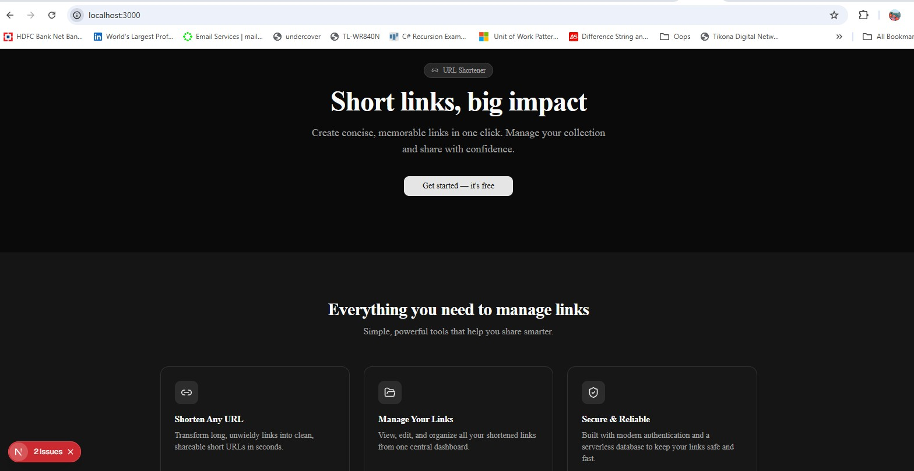
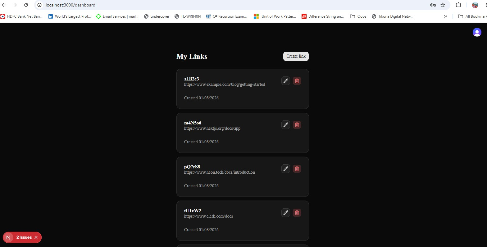
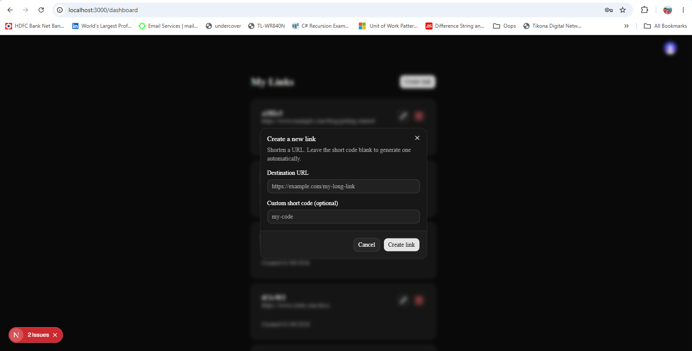
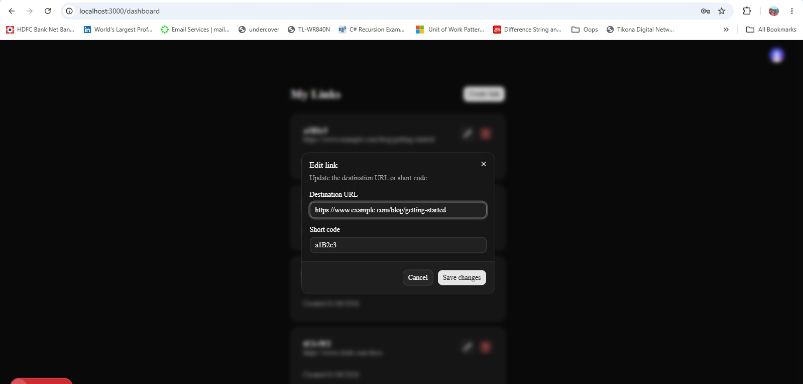
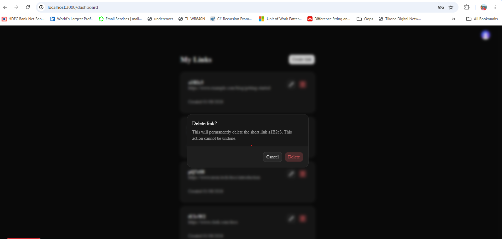

## Built by AI

This project is built entirely through AI instructions, prompts, and skills — no hand-written implementation code. All security vulnerabilities are checked via AI instructions and resolved by AI subagents, and all file formatting is enforced by AI-driven GitHub hooks.

- Used Neon MCP to connect to the Neon database to migrate data from the local database to the Neon database.
- Created a [`design-diagram-generator`](.agents/skills/design-diagram-generator/SKILL.md) skill that generates Mermaid design diagrams (flowchart, sequence, ER, class, state, or architecture) for a task or for the whole project, grounded in the actual code. It was used to produce the project architecture diagrams in [docs/diagrams](docs/diagrams).

## Getting Started

First, run the development server:

```bash
npm run dev
# or
yarn dev
# or
pnpm dev
# or
bun dev
```

Open [http://localhost:3000](http://localhost:3000) with your browser to see the result.

You can start editing the page by modifying `app/page.tsx`. The page auto-updates as you edit the file.

This project uses [`next/font`](https://nextjs.org/docs/app/building-your-application/optimizing/fonts) to automatically optimize and load [Geist](https://vercel.com/font), a new font family for Vercel.

## Screenshots

### Home page

Landing page introducing the URL shortener, with a call to action to get started.



### Dashboard

The "My Links" dashboard listing a user's shortened links with edit and delete actions.



### Create a short link

Dialog for shortening a new URL, with an optional custom short code.



### Edit a short link

Dialog for updating the destination URL or short code of an existing link.



### Delete a short link

Confirmation dialog before permanently deleting a short link.



## Learn More

To learn more about Next.js, take a look at the following resources:

- [Next.js Documentation](https://nextjs.org/docs) - learn about Next.js features and API.
- [Learn Next.js](https://nextjs.org/learn) - an interactive Next.js tutorial.

You can check out [the Next.js GitHub repository](https://github.com/vercel/next.js) - your feedback and contributions are welcome!

## Deploy on Vercel

The easiest way to deploy your Next.js app is to use the [Vercel Platform](https://vercel.com/new?utm_medium=default-template&filter=next.js&utm_source=create-next-app&utm_campaign=create-next-app-readme) from the creators of Next.js.

Check out our [Next.js deployment documentation](https://nextjs.org/docs/app/building-your-application/deploying) for more details.
