# Link Shortener — Request Flow Sequence Diagram

Combined view of the app's main request flows: route protection, dashboard load,
link CRUD (Server Actions), and the public short-link redirect. Swimlanes are
fixed as UI → Auth → Service → Database (see
[project-sequence-diagrams skill](../../.agents/skills/project-sequence-diagrams/SKILL.md)).

```mermaid
sequenceDiagram
    participant UI
    participant Auth
    participant Service
    participant Database

    rect rgb(235, 245, 255)
    Note over UI,Database: Flow: Route protection (proxy.ts)
    UI->>Auth: GET /dashboard
    Auth->>Auth: clerkMiddleware: isProtectedRoute? auth.protect()
    alt not signed in
        Auth-->>UI: redirect to sign-in
    else signed in
        Auth-->>UI: allow request through
    end
    end

    rect rgb(235, 255, 240)
    Note over UI,Database: Flow: Dashboard load (app/dashboard/page.tsx)
    UI->>Service: render DashboardPage()
    Service->>Auth: auth()
    alt no userId
        Auth-->>Service: userId = null
        Service-->>UI: redirect("/")
    else userId present
        Auth-->>Service: userId
        Service->>Database: getLinksForCurrentUser() -> select where userId
        Database-->>Service: links[]
        Service-->>UI: render links list
    end
    end

    rect rgb(255, 245, 235)
    Note over UI,Database: Flow: Create link (createLinkAction)
    UI->>Service: createLinkAction(url, customCode)
    Service->>Auth: auth()
    alt not signed in
        Auth-->>Service: userId = null
        Service-->>UI: { error: "You must be signed in..." }
    else signed in
        Auth-->>Service: userId
        Service->>Service: validate input (Zod)
        alt invalid input
            Service-->>UI: { error: <validation message> }
        else valid input
            Service->>Database: getLinkByShortCode(shortCode)
            Database-->>Service: existing link or null
            alt short code taken
                Service-->>UI: { error: "That short code is already taken." }
            else available
                Service->>Database: insert link (userId, url, shortCode)
                Database-->>Service: created link
                Service-->>UI: revalidatePath("/dashboard") + { success: true }
            end
        end
    end
    end

    rect rgb(250, 235, 255)
    Note over UI,Database: Flow: Update link (updateLinkAction)
    UI->>Service: updateLinkAction(id, url, customCode)
    Service->>Auth: auth()
    alt not signed in
        Auth-->>Service: userId = null
        Service-->>UI: { error: "You must be signed in..." }
    else signed in
        Auth-->>Service: userId
        Service->>Service: validate input (Zod)
        alt invalid input
            Service-->>UI: { error: <validation message> }
        else valid input
            Service->>Database: getLinkByShortCode(customCode)
            Database-->>Service: existing link or null
            alt short code taken by another link
                Service-->>UI: { error: "That short code is already taken." }
            else available
                Service->>Database: update link where id AND userId
                Database-->>Service: updated link or null
                alt not found / not owned
                    Service-->>UI: { error: "Link not found." }
                else updated
                    Service-->>UI: revalidatePath("/dashboard") + { success: true }
                end
            end
        end
    end
    end

    rect rgb(255, 235, 235)
    Note over UI,Database: Flow: Delete link (deleteLinkAction)
    UI->>Service: deleteLinkAction(id)
    Service->>Auth: auth()
    alt not signed in
        Auth-->>Service: userId = null
        Service-->>UI: { error: "You must be signed in..." }
    else signed in
        Auth-->>Service: userId
        Service->>Database: delete link where id AND userId
        Database-->>Service: deleted link or null
        alt not found / not owned
            Service-->>UI: { error: "Link not found." }
        else deleted
            Service-->>UI: revalidatePath("/dashboard") + { success: true }
        end
    end
    end

    rect rgb(240, 240, 240)
    Note over UI,Database: Flow: Public short-link redirect (app/l/[shortCode]/route.ts)
    UI->>Service: GET /l/:shortCode
    Note right of Auth: No Auth check — public route
    Service->>Database: getLinkByShortCode(shortCode)
    Database-->>Service: link or null
    alt link not found
        Service-->>UI: redirect to "/"
    else link found
        Service-->>UI: redirect to link.url
    end
    end
```

