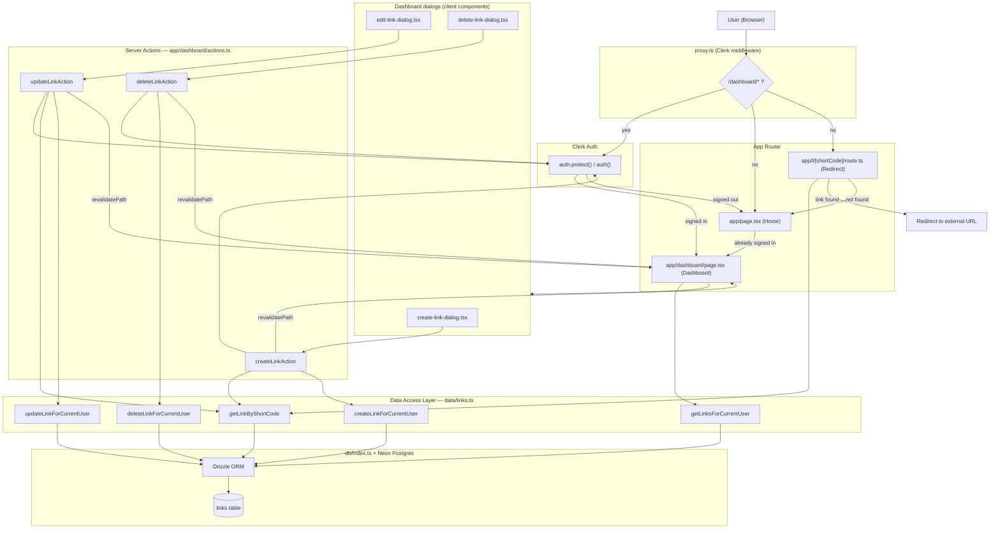

# Project Architecture — Flow Diagram

Overall request flow for the URL shortener: auth gating at the proxy, page/route
dispatch, server actions, the data access layer, and the database.

```mermaid
flowchart TD
    U["User (Browser)"]

    subgraph Edge["proxy.ts (Clerk middleware)"]
        P{"/dashboard/* ?"}
    end

    subgraph AuthSvc["Clerk Auth"]
        Protect["auth.protect() / auth()"]
    end

    subgraph Pages["App Router"]
        Home["app/page.tsx (Home)"]
        Dash["app/dashboard/page.tsx (Dashboard)"]
        Redir["app/l/[shortCode]/route.ts (Redirect)"]
    end

    subgraph UI["Dashboard dialogs (client components)"]
        Create["create-link-dialog.tsx"]
        Edit["edit-link-dialog.tsx"]
        Delete["delete-link-dialog.tsx"]
    end

    subgraph Actions["Server Actions — app/dashboard/actions.ts"]
        CA["createLinkAction"]
        UA["updateLinkAction"]
        DA["deleteLinkAction"]
    end

    subgraph DAL["Data Access Layer — data/links.ts"]
        GL["getLinksForCurrentUser"]
        GLC["getLinkByShortCode"]
        CL["createLinkForCurrentUser"]
        UL["updateLinkForCurrentUser"]
        DL["deleteLinkForCurrentUser"]
    end

    subgraph Data["db/index.ts + Neon Postgres"]
        Drz["Drizzle ORM"]
        PG[("links table")]
    end

    U --> P
    P -- yes --> Protect
    P -- no --> Home
    P -- no --> Redir
    Protect -- signed in --> Dash
    Protect -- signed out --> Home

    Home -- already signed in --> Dash

    Dash --> GL --> Drz --> PG
    Dash --> UI

    Create --> CA
    Edit --> UA
    Delete --> DA

    CA --> Protect
    UA --> Protect
    DA --> Protect

    CA --> GLC
    UA --> GLC
    CA --> CL --> Drz
    UA --> UL --> Drz
    DA --> DL --> Drz

    CA -- revalidatePath --> Dash
    UA -- revalidatePath --> Dash
    DA -- revalidatePath --> Dash

    Redir --> GLC --> Drz
    Redir -- link found --> Ext["Redirect to external URL"]
    Redir -- not found --> Home
```
