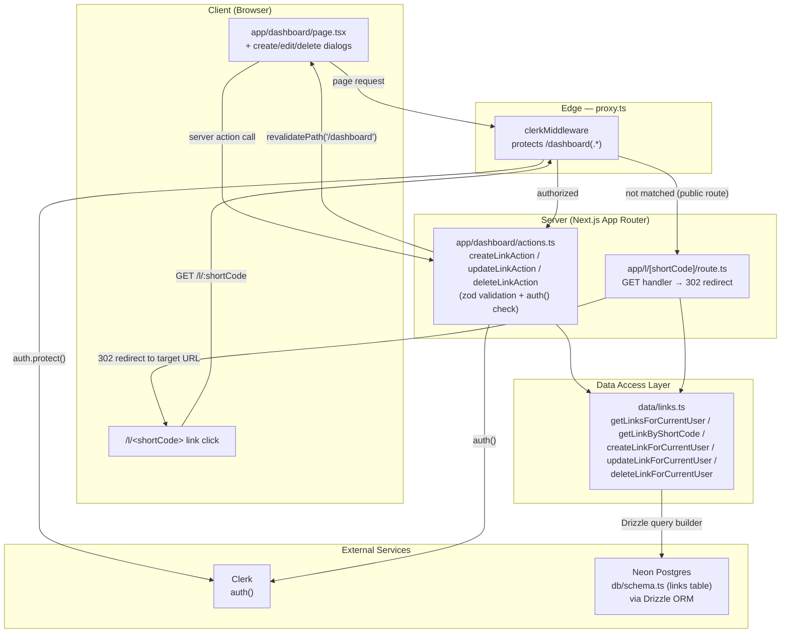

# Project Architecture — Flowchart

Grounded in the actual code layout: `proxy.ts`, `app/dashboard`, `app/l/[shortCode]`, `data/links.ts`, `db/schema.ts`.

## Layers

- **Client** — `app/dashboard/page.tsx` renders the user's links and hosts the create/edit/delete dialogs; a short link visit hits `/l/[shortCode]`.
- **Edge (`proxy.ts`)** — `clerkMiddleware` protects `/dashboard(.*)`; the public redirect route bypasses it.
- **Server** — `app/dashboard/actions.ts` are Server Actions that validate input with `zod`, re-check `auth()`, then call the data layer; `app/l/[shortCode]/route.ts` is a Route Handler that looks up the short code and issues a redirect.
- **Data Access Layer** — `data/links.ts` centralizes all Drizzle queries and always scopes user data by `userId`.
- **External services** — Clerk for authentication, Neon Postgres (via Drizzle) for the `links` table.
