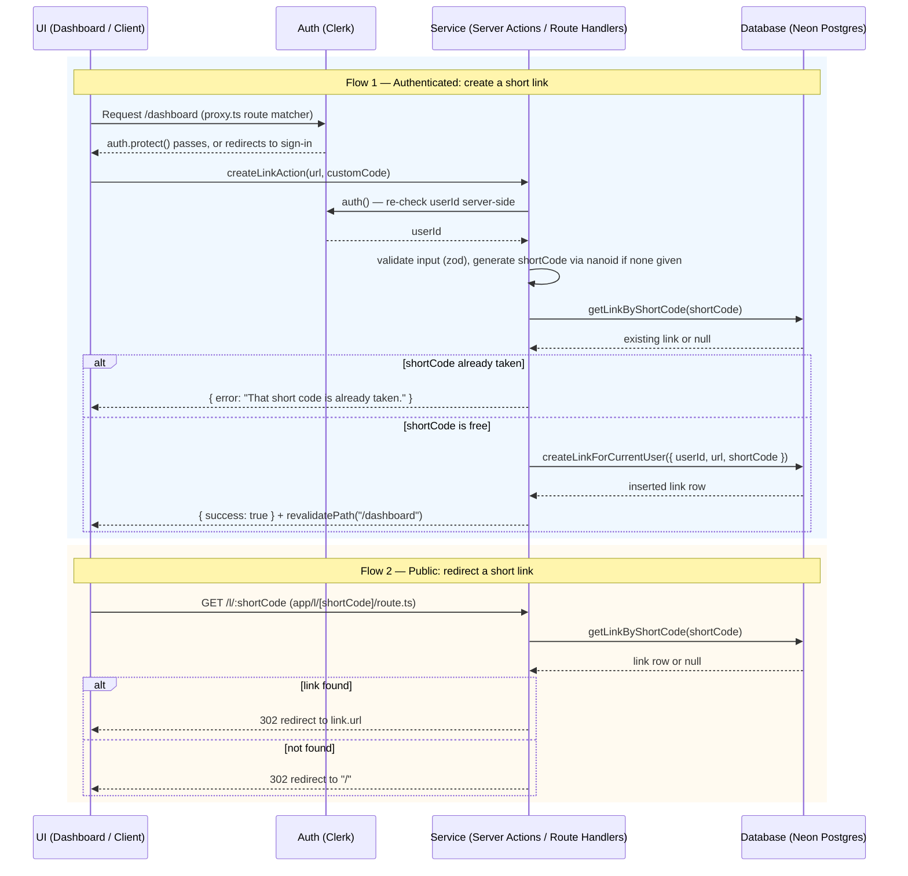

# Project Architecture — Sequence Diagram

Covers the two core flows of the URL shortener across the UI, Auth, Service, and Database layers.

```mermaid
sequenceDiagram
    participant UI as UI (Dashboard / Client)
    participant Auth as Auth (Clerk)
    participant Service as Service (Server Actions / Route Handlers)
    participant Database as Database (Neon Postgres)

    rect rgb(240, 248, 255)
    Note over UI,Database: Flow 1 — Authenticated: create a short link
    UI->>Auth: Request /dashboard (proxy.ts route matcher)
    Auth-->>UI: auth.protect() passes, or redirects to sign-in
    UI->>Service: createLinkAction(url, customCode)
    Service->>Auth: auth() — re-check userId server-side
    Auth-->>Service: userId
    Service->>Service: validate input (zod), generate shortCode via nanoid if none given
    Service->>Database: getLinkByShortCode(shortCode)
    Database-->>Service: existing link or null
    alt shortCode already taken
        Service-->>UI: { error: "That short code is already taken." }
    else shortCode is free
        Service->>Database: createLinkForCurrentUser({ userId, url, shortCode })
        Database-->>Service: inserted link row
        Service-->>UI: { success: true } + revalidatePath("/dashboard")
    end
    end

    rect rgb(255, 250, 240)
    Note over UI,Database: Flow 2 — Public: redirect a short link
    UI->>Service: GET /l/:shortCode (app/l/[shortCode]/route.ts)
    Service->>Database: getLinkByShortCode(shortCode)
    Database-->>Service: link row or null
    alt link found
        Service-->>UI: 302 redirect to link.url
    else not found
        Service-->>UI: 302 redirect to "/"
    end
    end
```
